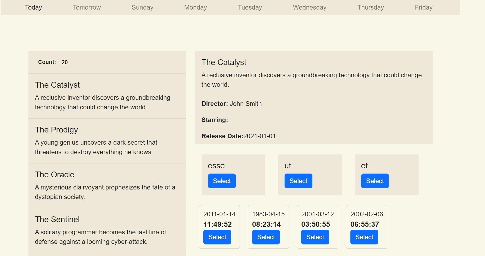
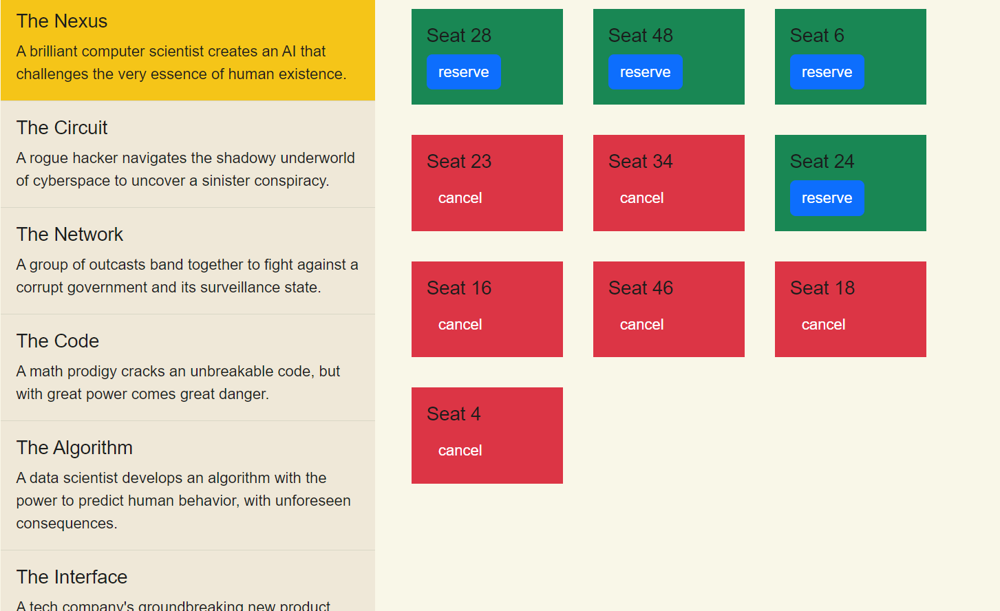

<h1 align="center">
Ticketposs
</h1>

<div align="center">

> Cinema tickets POS (point of sale) running on NGINX/https using VueJS, Laravel and docker 

</div>

---	


### Progress


- Upgraded to MYSQL8 - Installed Redis 
- Modified Ngix config and SSL self-signed cert for dev - Added config forLoadBalancer
- Modified seeds with related records data using Faker and importing ```database/movies.json```
- Refactored the project's structure
- PHPUNIT test cases

### In progress
<ul>

  <li> <input type="checkbox" disabled checked /> <del>Finish seeders</del> </li>
  <li> <input type="checkbox" disabled checked /> <del> redesign UI - Vue and the UX </del></li>
  <li> <input type="checkbox" disabled  /> <del> Redis queue setup - supervisor </del></li>

  <li> <input type="checkbox" disabled  /> <del> Added dos2unix to run docker on Mac sleekly</del></li>
  <li> <input type="checkbox" disabled /> Complete UNIT testing </li>
  <li> <input type="checkbox" disabled /> Use Redis as a middleware to queue db queries </li>


</ul>

### TODO
- Complete dos2unix integration
- Movie Recommendation system using Neo4j and regression
- Improv seed by using MovieSeeder and TMDB api
- Improve Redis queues to 
  - Seed a MySQL database
  - Runn PHPUnit tests
  - Render Vue templates
  - Interact with Composer, Webpack, and MySQL databases
- Implement User role
- Use Jenkins to pipeline CI/CD
- Use web sockets/PUSHER to update the seat availability status in real-time
- Create reports and analytics to track reservation trends, occupancy rates, and revenue. (Laravel Excel)
- Implement automated reminders to remind guests of their reservations closer to the reservation date and time. (Laravel Task Scheduling – Twilio)


---	

##  Fast links:

Endpoint | description
------------ | -------------
http://localhost:8888/ | http app
http://localhost:4433/ | https app
https://localhost:8080/ |  phpmyadmin
http://localhost:8888/api/receptionist/movies | http api/movies 
http://localhost:8888/api/receptionist/halls/{movieId} | http api/halls 
http://localhost:8888/api/receptionist/showtimes/{movieId}/{hallId} | http api/showtimes 
http://localhost:8888/api/receptionist/seats/{movieId}/{hallId}/{showtimeId} | http api/seats 


---

## UI
[](#)
[](#)

## 1. Getting Started


### Using Docker

##### 1st time only
```
docker-compose up -d --build 
```

##### 1. Installing Dependencies 

```
docker-compose up -d
docker-compose run composer install -n
docker-compose run npm install
```
##### 2. Building Assets For Development

```
docker-compose run npm run dev
```

##### 3. Migrate and Seed MYSQL DB with Laravel CLI

```
docker-compose run artisan migrate
docker-compose run artisan db:seed
```

---	
### Manual Without Docker
##### You can start a webserver with light servers like 
[usbwebserver](https://www.usbwebserver.net/webserver/)
```
p.s: If you intend to use it for the project.
first downgrade composer requirements or find updated alternative like WAMP or MAMP
````

```sh
cd src/
```
##### 1. Installing Dependencies

```
composer install
npm install
```

##### 2. Create .env and update it with ur conf

#####  Using Composer run commands

```
composer post-root-package-install
```

###### Using CLI Linux
```sh
cp -a .env.example .env 
```
###### Modify env
```
DB_CONNECTION=mysql
DB_HOST=127.0.0.1
DB_PORT=3306
DB_DATABASE=ticketposs
DB_USERNAME=root
DB_PASSWORD=secret

```
##### 3. Migrating and Seeding MYSQL DB

##### create mysql DB ticketposs 
```sql
CREATE USER 'root' @'%' IDENTIFIED BY 'secret';
GRANT ALL PRIVILEGES ON *.* TO 'root' @'%';
FLUSH PRIVILEGES;
CREATE DATABASE IF NOT EXISTS ticketposs;
```

```
php artisan migrate
php artisan db:seed
```
##### 4. Running PHP Server
```
php artisan serve
```
##### 5. Building Assets For Development

```
npm run dev
```
##### 6. Building Assets For Production

```
npm run prod
```

---	

##### 7. Running server

```
php artisan serve --port=8888
```


```
http://localhost:8888/
```


---	

## 2. phpmyadmin will be on:

``` 
https://localhost:8080/ 
```
### The default mysql and phpmyadmin creds are :
<div align="center">
<p><strong>User: </strong>  <em>root</em></p>
<p><strong>Pass: </strong>  <em>secret</em></p>
</div>

---	

## 3. The VueJS UI will be on:

```
http://localhost:8888/ 
```
---	
## 4. The Secure VueJS UI will be on:

``` 
https://localhost:4433/
```

---	
## 5. Then see the json returned from the movies API route here:

``` 
http://localhost:8888/api/receptionist/movies
```

---	
## Bundled [VueDevTools](https://chrome.google.com/webstore/detail/vuejs-devtools/nhdogjmejiglipccpnnnanhbledajbpd) And [LaravelDevBar](http://phpdebugbar.com/docs/)


---	

## In case you need to regenerate SSL keys 

Open the command line and run these commands inside the ```services/nginx/ssl``` folder to generate a self signed certificate:


``` openssl req -new -newkey rsa:2048 -x509 -sha512 -days 365 -nodes -out nginx.crt -keyout nginx.key ```


``` openssl dhparam -out dhparam.pem 2048 ```


--- 